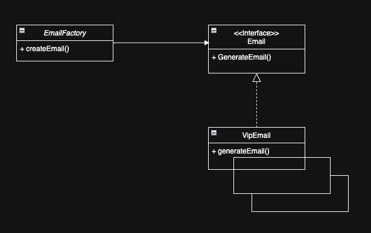

| CS-665       | Software Design & Patterns |
|--------------|----------------------------|
| Name         | Keith Kwan                 |
| Date         | 10/21/2025                 |
| Course       | Fall                       |
| Assignment # | 3                          |

# Assignment Overview

For assignment 2 we are tasked with creating the skeleton of a delivery app, connecting shops and drivers. The core functionality from this assignment is the ability to connnect shops with drivers as well as send notifications out to driver when an order is placed.

For assignment 3 we are tasked with creating a solution for businesses to use to streamline their emails to different clients. We need to be able to generate different template of emails based on the customer types.

# GitHub Repository Link:
https://github.com/kkeith88/cs-665-assignment-2

# Implementation Description 


For each assignment, please answer the following:

- Explain the level of flexibility in your implementation, including how new object types can
be easily added or removed in the future.
    - In this assignment, the approach is flexible because if we wanted to add a new type of customer type, we would first add it to the list of enums for customer type and then create their java class implementing the email interface. 
- Discuss the simplicity and understandability of your implementation, ensuring that it is
easy for others to read and maintain.
    - My approach was to use the keep it simple while still satisfying the requirements as well as being able to extend functionality for future iterations. A developer iterating on this project would identify by looking at the `EmailFactory` Class that they would need to create a new email class, and upon their investigation of an existing email class they will see it extends the email interface.

- Describe how you have avoided duplicated code and why it is important.
    - In this assignment, I did not run into many cases where I found myself naturally duplicating code. I had the idea to extract strings in the email template that may be reuseable such as `sincerely - team` and put them in a constants file. While it would make the code more modular, it would add an extra layer of complexity and since the other parts of the email are more tailored to a specific customer type then it wouldn't prove as useful in eliminating code duplication. However if this was a larger project, then definelty having the full string be put into a constants file would be better practice. 
- If applicable, mention any design patterns you have used and explain why they were
chosen.
    - For this assignment, the factory pattern seemed like the go to choice. This is because we will need to create many different objects that are slightly different from eachother but that we still want to be separate objects. The example that comes to mind is a pizza shop wanting to create many differnet type of pizzas. Our requirements are similar to the pizza shop as we want to create many different email templates. The factory pattern also encapsulates the object creation logic, making it easier to maintain and modify email templates without affecting the client code. 

### Design Choices / Assumptions / Thought Process:
I had gone with the simple factory approach rather than the standard one where the , I trade a bit of modularity and robustness but for the added benefit that this is the simplest way to satisfy our requirements while not overcomplicating it. I had thought to follow closely to the standard factory pattern where the factory and the products both implement their respective interface, however it seemed that if I omitted the factory interface and instead just created the `EmailFactory` Class then I could just use that to return the correct type of email based on the parameter.

Using the simple factory pattern offered the highest ratio of functionality to complexity for this assignemnt


# UML Diagram


Note: Other classes are stacked under the VipEmail, other email classes include NewCustomerEmail, BusinessEmail, ... 

# Maven Commands

We'll use Apache Maven to compile and run this project. You'll need to install Apache Maven (https://maven.apache.org/) on your system. 

## Compile
Type on the command line: 

```bash
mvn clean compile
```


## JUnit Tests
JUnit is a popular testing framework for Java. JUnit tests are automated tests that are written to verify that the behavior of a piece of code is as expected.

To run, use the following command:
```bash
mvn clean test
```


## Spotbugs 

SpotBugs is a static code analysis tool for Java that detects potential bugs in your code.
Use the following command:

```bash
mvn spotbugs:gui 
```

For more info see 
https://spotbugs.readthedocs.io/en/latest/maven.html

SpotBugs https://spotbugs.github.io/ is the spiritual successor of FindBugs.


## Checkstyle 

Checkstyle is a development tool for checking Java source code against a set of coding standards.
The following command will generate a report in HTML format that you can open in a web browser. 

```bash
mvn checkstyle:checkstyle
```

The HTML page will be found at the following location:
`target/site/checkstyle.html`


